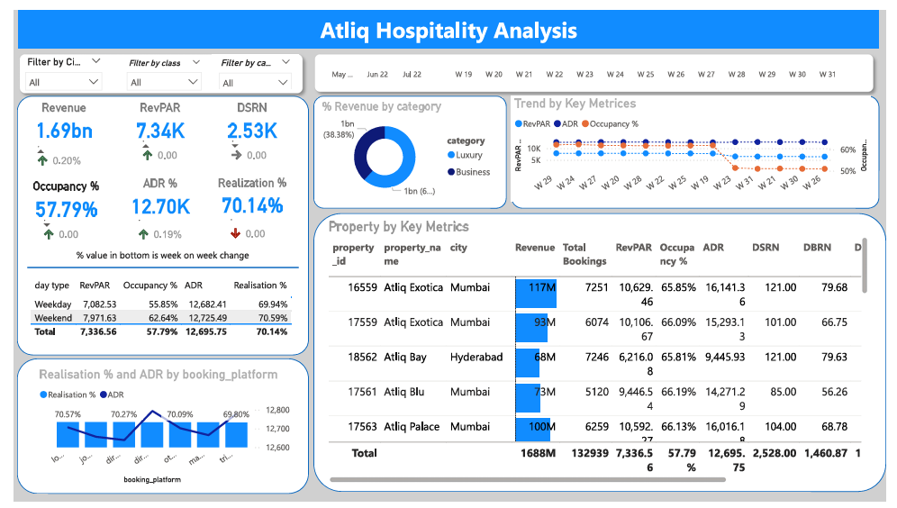
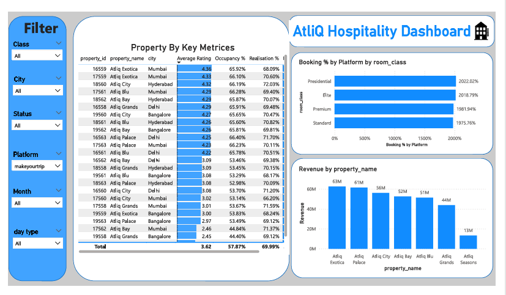
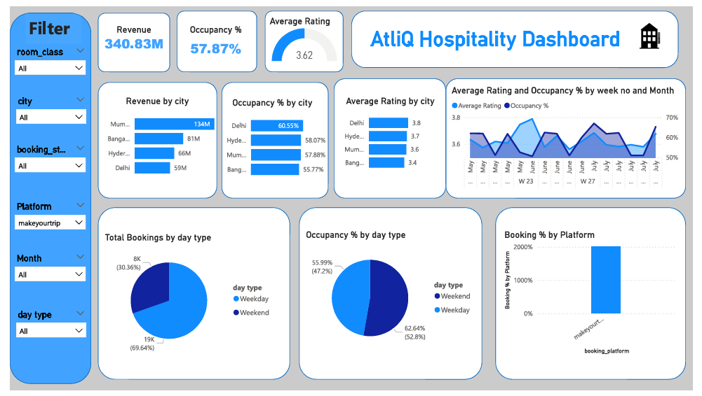

# 🏨 Hospitality Revenue & Performance Analytics Dashboard

## 📊 Project Overview

This project focuses on analyzing hotel booking and revenue data to understand the overall business performance of AtliQ Hospitality Business.

The project uses **Power BI, Power Query, DAX, and data modeling** to transform raw hospitality booking data into interactive dashboards for analyzing:

- Revenue performance
- Occupancy
- RevPAR
- ADR
- Booking volume
- Realization rate
- Cancellation and no-show behavior
- Property-level performance
- City-level performance
- Room-class performance
- Booking-platform contribution
- Week-over-week trends
- Weekday vs. weekend performance
- Customer ratings

The main objective was to convert raw booking data into meaningful business insights that can help hotel management monitor performance and identify areas requiring attention.

---

# 🎯 Business Problem

Hospitality Business has booking and hotel performance data spread across multiple tables containing information about:

- Hotels and properties
- Cities and hotel categories
- Room types
- Customer bookings
- Booking platforms
- Booking status
- Revenue
- Room capacity
- Successful bookings
- Customer ratings
- Dates and day types

Analyzing this information manually can make it difficult for management to quickly understand:

1. How much revenue is being generated?
2. Which properties and cities are performing well?
3. How efficiently is available room capacity being utilized?
4. Which booking platforms generate the most bookings?
5. What percentage of bookings are successfully realized?
6. How do weekday and weekend performances differ?
7. Which properties have high or low occupancy?
8. How are key business KPIs changing over time?

Therefore, an interactive business intelligence solution was required to provide a centralized view of hotel performance.

---

# 🎯 Project Objectives

The main objectives of this project were:

### 1. Build a Centralized Hospitality Performance Dashboard

Create an interactive Power BI dashboard that brings important hotel KPIs into a single view.

### 2. Monitor Key Business KPIs

Track:

- Revenue
- RevPAR
- Occupancy %
- ADR
- Realization %
- DSRN
- DBRN
- DURN
- Total Bookings
- Average Rating
- Cancellation %
- No-Show Rate

### 3. Analyze Property Performance

Compare individual properties based on:

- Revenue
- Occupancy
- RevPAR
- ADR
- Bookings
- DSRN
- DBRN
- Customer ratings

### 4. Analyze City-Level Performance

Understand differences in:

- Revenue
- Occupancy
- Average rating

across Mumbai, Bangalore, Hyderabad, and Delhi.

### 5. Analyze Booking Behavior

Understand booking contribution across different booking platforms and room classes.

### 6. Analyze Time-Based Performance

Identify trends across:

- Week
- Month
- Weekday
- Weekend

### 7. Enable Interactive Business Analysis

Provide slicers and filters that allow users to drill into performance by:

- City
- Property
- Hotel class
- Room class
- Booking status
- Booking platform
- Month
- Day type

---

# 🗂️ Dataset

The project uses five main tables.

## Dimension Tables

### `dim_date`

Contains:

- Date
- Month-Year
- Week Number
- Day Type

The dataset covers **May, June, and July 2022**.

### `dim_hotels`

Contains:

- Property ID
- Property Name
- Hotel Category
- City

### `dim_rooms`

Contains:

- Room ID
- Room Class

Room classes include:

- Standard
- Elite
- Premium
- Presidential

## Fact Tables

### `fact_bookings`

Contains individual booking-level information including:

- Booking ID
- Property ID
- Booking Date
- Check-in Date
- Check-out Date
- Number of Guests
- Room Category
- Booking Platform
- Customer Rating
- Booking Status
- Revenue Generated
- Revenue Realized

### `fact_aggregated_bookings`

Contains aggregated room-level information:

- Property ID
- Check-in Date
- Room Category
- Successful Bookings
- Capacity

---

# 🏗️ Data Model

The project follows a dimensional modeling approach with hotel, room, and date dimensions connected to booking-related fact tables.

```text
                         ┌──────────────┐
                         │   dim_date   │
                         └──────┬───────┘
                                │
                                ▼
┌─────────────┐        ┌────────────────┐        ┌─────────────┐
│ dim_hotels  │───────►│ fact_bookings  │◄───────│  dim_rooms  │
└─────────────┘        └────────────────┘        └─────────────┘
        │
        │
        ▼
┌──────────────────────────────┐
│ fact_aggregated_bookings     │
└──────────────────────────────┘
```

---

# 📊 Power BI Dashboards

The project consists of three interactive Power BI dashboards designed to analyze hotel revenue, occupancy, property performance, booking behavior, and customer-related metrics.

The dashboards provide different levels of analysis, starting from an overall business summary and moving toward property, city, booking-platform, and time-based analysis.

---

## 📊 Dashboard 1 — Executive Performance Overview

### 🎯 Objective

The objective of this dashboard is to provide management with a high-level overview of overall hotel business performance.

It brings the most important KPIs and trends into a single view so that users can quickly monitor revenue, occupancy, ratings, and overall booking performance.

### 📌 Key KPIs

- Revenue
- Occupancy %
- Average Rating
- Booking Performance
- Weekly Trends

### 📈 Key Visualizations

- KPI cards for overall performance
- Weekly trend analysis
- Revenue by city
- Occupancy % by city
- Average rating by city
- Property-level KPI comparison
- Occupancy by day type
- Booking contribution by platform

### 🔍 What This Dashboard Helps Answer

- How is the hotel business performing overall?
- Which cities generate the most revenue?
- Which cities have higher occupancy?
- How does customer rating vary across cities?
- How is performance changing over time?
- How does occupancy differ between weekdays and weekends?
- Which booking platforms contribute most to bookings?

### 💡 Key Insight

The dashboard provides a centralized management view where users can quickly identify changes in revenue, occupancy, customer ratings, and booking performance before performing deeper analysis.

### 🖼️ Dashboard Preview



---

# 📊 Dashboard 2 — Property Performance Analysis

### 🎯 Objective

The objective of this dashboard is to analyze hotel/property-level performance and compare properties using important business KPIs.

This view helps identify differences in revenue, occupancy, ratings, and booking performance across individual properties.

### 📌 Key Metrics

- Revenue
- Occupancy %
- Average Rating
- Realization %
- Booking Performance
- Property
- City

### 📈 Key Visualizations

- Property-wise revenue analysis
- Property-wise occupancy analysis
- Average rating by property
- Property KPI comparison
- Room-class performance
- Booking-platform performance
- Property-level detailed table

### 🔍 What This Dashboard Helps Answer

- Which properties generate higher revenue?
- Which properties have higher occupancy?
- Which properties have lower occupancy?
- Which properties receive better customer ratings?
- How does performance vary between properties in different cities?
- Which room classes contribute more bookings?
- How does booking-platform performance vary by property?

### 💡 Key Insight

The property-level analysis shows that hotel performance is not uniform across all properties. Comparing multiple KPIs together helps identify properties that require further investigation rather than relying only on total revenue.

### 🖼️ Dashboard Preview



---

# 📊 Dashboard 3 — City, Booking & Trend Analysis

### 🎯 Objective

The objective of this dashboard is to analyze hotel performance from different business dimensions such as city, booking platform, day type, and time period.

It provides a more detailed view of booking behavior and helps identify revenue and occupancy patterns.

### 📌 Key Analysis Areas

- City-wise revenue
- City-wise occupancy
- Average customer rating
- Weekly trends
- Weekday vs. weekend performance
- Booking-platform contribution
- Room-class booking performance

### 📈 Key Visualizations

#### 🌆 City Analysis

Compare:

- Revenue by city
- Occupancy by city
- Average rating by city

#### 📅 Time Analysis

Analyze:

- Weekly trends
- Weekday vs. weekend bookings
- Occupancy by day type

#### 🌐 Booking Platform Analysis

Compare booking contribution across platforms such as:

- MakeYourTrip
- Logtrip
- Direct Online
- Tripster
- Journey
- Direct Offline
- Others

#### 🛏️ Room Class Analysis

Analyze booking contribution across different room categories.

### 🔍 What This Dashboard Helps Answer

- Which city generates the highest revenue?
- Which city has the highest occupancy?
- Which city has the highest customer rating?
- Are weekends performing better than weekdays?
- Which booking platforms contribute the most bookings?
- Which room classes have higher booking demand?
- Are there noticeable changes in performance across weeks?

### 💡 Key Insight

The dashboard allows business users to understand that revenue, occupancy, customer ratings, and booking volume can behave differently across cities and business dimensions. Therefore, these KPIs should be analyzed together when evaluating hotel performance.

### 🖼️ Dashboard Preview



---

# 🔄 Interactive Filters

All dashboards provide interactive filtering capabilities to allow users to analyze specific segments of the business.

Available filters include:

- 🏨 Property
- 🌆 City
- 📌 Booking Status
- 🌐 Booking Platform
- 📅 Month
- 📆 Week

Users can combine these filters to perform more detailed analysis.

For example:

> Select a specific city → select a property → select a booking platform → analyze revenue, occupancy, and booking trends for that specific segment.

---

# 🧠 Overall Analytical Approach

The dashboards follow a progression from **high-level monitoring to detailed analysis**:

```text
                  Raw Hospitality Data
                           ↓
                    Data Preparation
                           ↓
                     Data Modeling
                           ↓
                      DAX Measures
                           ↓
              ┌────────────┴────────────┐
              ↓                         ↓
      Executive Overview        Detailed Analysis
              ↓                         ↓
        Dashboard 1             Dashboard 2 & 3
              ↓                         ↓
        Overall KPIs          Property / City / Platform
              └────────────┬────────────┘
                           ↓
                    Business Insights
                           ↓
                     Decision Support
```

---

# 🛠️ Tools & Technologies

- **Power BI** — Dashboard development and data visualization
- **Power Query** — Data cleaning and transformation
- **DAX** — KPI calculations and analytical measures
- **Data Modeling** — Relationships between dimension and fact tables
- **Excel / CSV** — Source hospitality data

---

# 📌 Project Outcome

The project transforms raw hospitality booking data into an interactive Power BI reporting solution that enables users to analyze:

- Overall business performance
- Revenue and occupancy
- Property performance
- City-level performance
- Booking-platform contribution
- Room-class demand
- Weekday vs. weekend behavior
- Customer ratings
- Time-based trends

The dashboards provide a structured way to move from **raw data → KPIs → analysis → business insights**.
